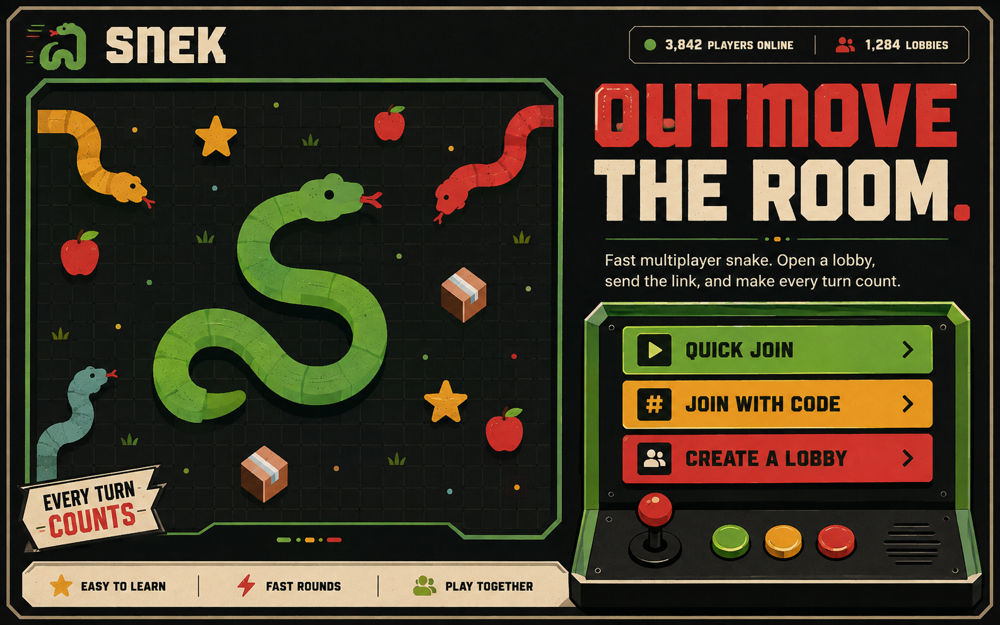
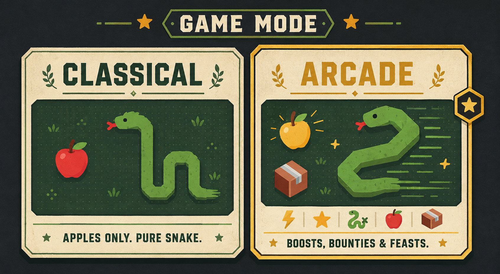
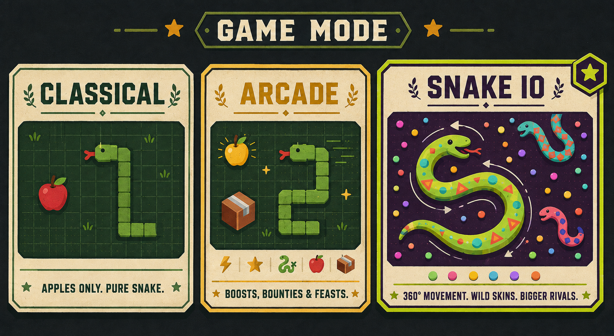
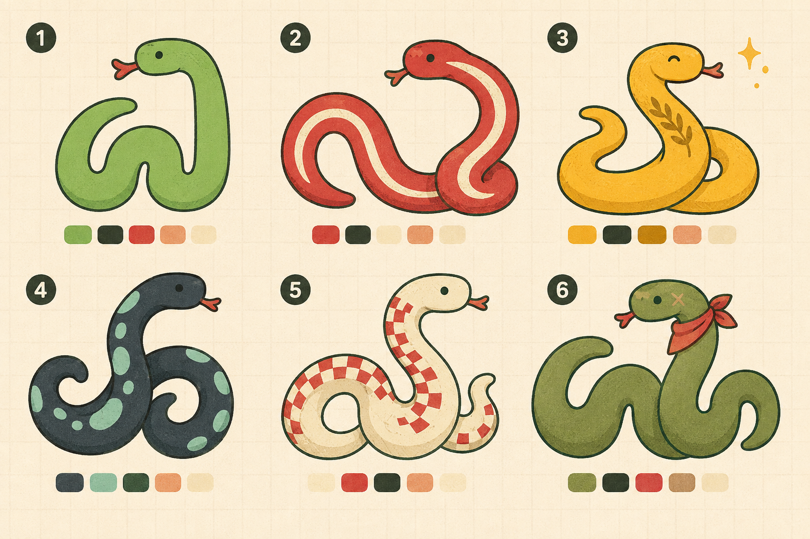
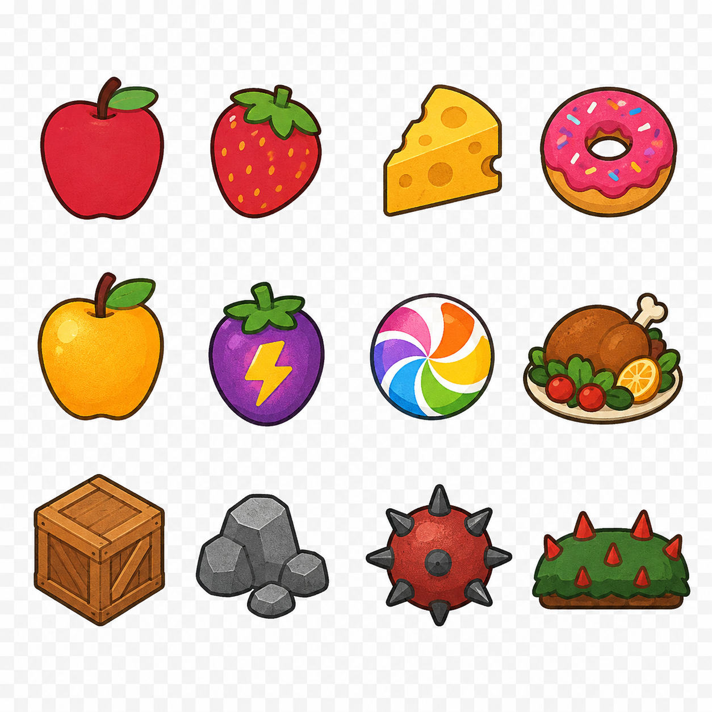

# Snek visual references

This folder contains generated visual direction boards plus runtime-oriented PNG exports for the Snek landing flow, game modes, snake skins, pickups, and hazards.

## Interface boards

### `landing-page.png`



A full desktop landing-page direction. The left side treats the arena as the hero artwork; the right side turns lobby actions into an arcade control deck. The intended hierarchy is:

1. Snek identity and live server population.
2. “Outmove the room.” positioning.
3. Quick Join as the fastest action.
4. Join With Code and Create a Lobby as deliberate alternatives.

The board establishes the shared palette: near-black charcoal, warm cream, leaf green, tomato red, and sunflower yellow. Its print texture is decorative; controls should remain crisp in implementation.

### `lobby-join.png`


A focused join state with a segmented five-digit lobby code, optional password, primary Join Lobby action, fallback open-game search, and live server counts. The snake points into the primary action to reinforce direction without adding UI chrome.

### `mode-selector.png`



The original two-mode comparison:

- **Classical** — apples only, pure grid-based snake.
- **Arcade** — the same orthogonal movement model with boosts, golden apples, supply drops, bounties, remains, and feasts.

### `mode-selector-three-modes.png`



The expanded selector is the preferred direction. It separates the modes through both rules and visual grammar:

- **Classical** uses a quiet green grid, a single red apple, and simple 90-degree turns.
- **Arcade** keeps grid movement but adds gold, pickups, speed cues, and supply-drop energy.
- **Snake IO** uses continuous **360-degree steering**, a deep-violet field, acid-lime snakes, coral/cyan markings, dense edible pellets, and more expressive skins. This mode should always look more colorful and kinetic than Classical or Arcade.

## Snake artwork

### `snake-character-sheet.png`



The character sheet defines six personalities:

1. **Classic Green** — the default friendly Snek skin.
2. **Tomato Racer** — red with a cream racing stripe.
3. **Golden Champion** — gold with a laurel marking.
4. **Midnight Mint** — charcoal with large mint spots.
5. **Cream Checker** — warm cream with red checker markings.
6. **Moss Veteran** — muted green with a scar and red bandana.

The source modular boards are named `snake-kit-<skin>.png`. Each contains a head, straight body, 90-degree turn, and tapered tail. These boards are art references; use the processed files under `runtime/snakes/` in rendering code.

### Snake IO 360-degree kit

`snake-kit-io-360.png` defines the special free-movement skin language: acid lime, deep violet, coral, and cyan. Its runtime pieces are designed around rotation rather than grid corners:

- `io-360-head.png` — rotate to the current heading.
- `io-360-body.png` — a circular body node that can follow any curve.
- `io-360-tail.png` — rotate to the final path tangent.
- `io-360-boost-ring.png` — optional boost feedback, centered on the snake or head.

For smooth IO snakes, sample points along the movement trail and draw circular body nodes back-to-front. Rotate only the head and tail. This supports unrestricted 360-degree steering without requiring hundreds of pre-rendered angles.

## Pickups and hazards

### `pickups-obstacles.png`



The atlas contains twelve objects. Individual transparent 256×256 exports are in `runtime/pickups/` and `runtime/hazards/`.

| Asset | Type | Suggested gameplay meaning |
| --- | --- | --- |
| Apple | Food | Standard growth and score. |
| Strawberry | Food | Small, quick-spawning snack. |
| Cheese | Food | Medium growth with a slightly higher score. |
| Donut | Food | Larger growth with a brief handling penalty if desired. |
| Golden apple | Powerup | Rare high-value growth or score multiplier. |
| Lightning berry | Powerup | Temporary speed boost. |
| Rainbow candy | Powerup | Short magnet, invulnerability, or wildcard effect. |
| Feast platter | Event pickup | Starts a feast or drops a cluster of food. |
| Crate | Obstacle | Solid collision object or breakable supply drop. |
| Rocks | Obstacle | Static collision cluster. |
| Spike mine | Hazard | Lethal contact or heavy length loss. |
| Thorn hedge | Hazard | Slows, damages, or blocks a lane. |

Round, bright silhouettes signal edible items. Angular, darker silhouettes signal hazards. Keep those semantics consistent if more objects are added.

## Runtime export layout

All runtime exports are RGBA PNGs with verified transparency.

```text
runtime/
  snakes/
    <skin>-atlas.png
    <skin>-head.png
    <skin>-body.png
    <skin>-turn.png
    <skin>-tail.png
    io-360-atlas.png
    io-360-head.png
    io-360-body.png
    io-360-tail.png
    io-360-boost-ring.png
  pickups/
    apple.png
    strawberry.png
    cheese.png
    donut.png
    golden-apple.png
    lightning-berry.png
    rainbow-candy.png
    feast-platter.png
  hazards/
    crate.png
    rocks.png
    spike-mine.png
    thorn-hedge.png
```

Every individual runtime sprite is normalized to a 256×256 transparent canvas. Scale them down with image smoothing enabled for the illustrated look, or disabled if a harder sprite edge is preferred. Collision geometry should remain server-defined and simpler than the painted silhouette.

## Generation brief

The images were generated with the built-in image generator using the existing `client/img/snek.png`, `apple.png`, `golden.png`, and `crate.png` as style anchors. The shared prompt direction was: friendly flat 2D arcade illustration, crisp dark outlines, restrained screen-print texture, charcoal/cream/green/red/gold base palette, no photorealism, no glassmorphism, and no invented product claims. The Snake IO extension explicitly adds 360-degree movement, violet/acid-lime/coral/cyan skins, candy-colored pellets, and smooth rotational sprite geometry.
